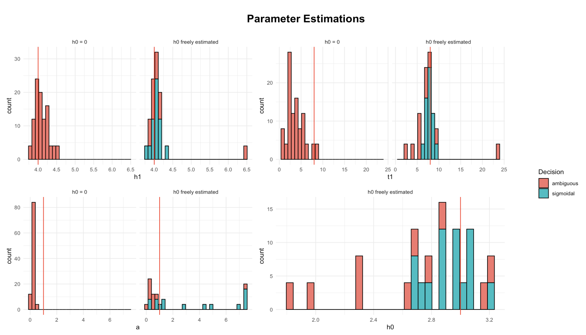

# Summary

The R package **sicegar** aims to quantify time intensity data by using sigmoidal and double-sigmoidal curves.
Each of the fits are used to make a decision on which model best describes the data. 
The method was originally developed in the context of single-cell viral growth analysis (for details, see @caglar2018), and the package name stands for "SIngle CEll Growth Analysis in R". 
In addition to categorizing the best model fit, **sicegar** returns parameter estimations for each of the model fits, which provides important information to researchers. 

In **sicegar**, the sigmoidal function is given as follows (with parameters estimated using the Levenberg-Marquardt algorithm [@levenberg1944;@marquardt1963]).
$h_0$ represents the lower asymptote (as $x$ approaches negative infinity).
$t_1$ is the onset time (the inflection point) and the midpoint between $h_0$ and $h_1$.
$a$ determines the magnitude of the slope of the sigmoidal curve.
$h_1$ is the upper asymptote (as $x$ approaches positive infinity).
The parameters describing a sigmoidal curve in equation $I(x)$ are graphically represented in **Figure 1**.

$I(x) = h_0 + \frac{h_1-h_0}{1 + e^{-a(x - t_1)}}$

A similar, but slightly more complicated, formula for the double-sigmoidal function is also used for parameter estimation in **sicegar**.
In the original implementation of **sicegar**, the parameter $h_0$ is set to zero for both the sigmoidal and double-sigmoidal models.

As previously mentioned, **sicegar**'s parameter estimation allows users to extract key model parameters, including the onset time of RNA expression in specific genes [@caglar2018].
Onset time is defined as the time when the half-maximal abundance of RNA is reached in the cell.
For example, @Adams uses **sicegar** to investigate the onset time of RNA expression in genes in *E. coli* undergoing stress. 

**Figure 1** Visualization of the sigmoidal curve and related parameter values.

In the case of the sigmoidal curve, $t_1$ is equivalent to onset time, and thus accurate estimations of $t_1$ are crucial for understanding transriptional timing of genes. 
However, @Adams observed limitations in **sicegar**'s fits, which motivated the package improvements proposed in our paper. 
Our primary update to the **sicegar** package is the inclusion and estimation of an additional parameter, $h_0$, which is the lower asymptote of both the sigmoidal and double-sigmoidal curves, which had previously been set equal to 0.
Based on simulated data, the free estimation of $h_0$ provides both a better overall model fit (lower SSE) and more accurate parameter estimations than when $h_0$ is forced to be equal to zero. 
For backward compatibility, the updated package is designed so that the $h_0 = 0$ is the default value.

# Statement of Need

@caglar2018 discuss **sicegar**'s ability to correctly identify sigmoidal and double-sigmoidal curves on simulated data.
They report, "Overall, we can conclude that our algorithm results in reliable fits, that it fails gradually with increasing noise levels, and that it is conservative in assessing whether it has correctly identified a sigmoidal or double-sigmoidal curve or not."
The focus of their results is on whether **sicegar** is able to correctly identify sigmoidal and double-sigmoidal curves on simulated data, not on whether it is able to accurately estimate parameters.
Although they acknowledge **sicegar**'s ability to estimate parameters associated with sigmoidal and double-sigmoidal curves, they do not report on the accuracy of the parameter estimates.

In dozens of papers that use **sicegar** for modeling time-intensity data, researchers are interested in extracting specific parameter estimates, e.g., midpoints and slopes, because the parameter values represent biologically meaningful information.
@Adams extracted $t_1$ to investigate onset time of RNA expression in genes in *E. coli* undergoing stress.
@wittemeier used **sicegar** to estimate molar carbon assimilation, using **sicegar**'s estimation of $a$ to understand maximum assimilation rate and $t_1$ to extract the point at which maximum assimilation is reached. 
@rajarathinam also used **sicegar** to analyze carbon assimilation and to extract estimations of $a$.
Our addition of $h_0$ to the set of estimated parameters greatly improves **sicegar**'s ability to provide accurate parameter estimations.
Though the categorization of the model as sigmoidal or double-sigmoidal is hugely important, it is not the only important aspect of the **sicegar** modeling.
Our updated implementation, which includes the estimation of the lower asymptote, is prevailingly important, and thus our adjustments fit the needs of current research. 

# Features 

### Core Functions

`fitAndCategorize`, the umbrella function in **sicegar**, takes time-intensity data as an argument and runs the data through a series of nested functions.
The process is outlined in **Figure 2**.
First, the data are normalized in the function `normalizeData` (1).
Then they are passed through `multipleFitFunction` (2) which uses the Levenberg-Marquardt algorithm [@levenberg1944;@marquardt1963] to fit both sigmoidal and double-sigmoidal curves to the data, (3), (4).
Additional parameters are estimated using `parameterCalculations`, and the model is visualized using `figureModelCurves`.
The user decides whether to allow the function to estimate $h_0$ using the argument `use_h0 = TRUE` in `fitAndCategorize`. 
If `use_h0` is set to `FALSE` (the default), the algorithm will run **sicegar** using the original implementation, with $h_0$ fixed at zero.
If the user chooses to estimate $h_0$, the same function flow is followed, and each sub-function will account for the estimation of $h_0$.

### Novel Contributions

Each function in **sicegar** was rewritten to include the parameter $h_0$. 
Our new version is outlined in the right-hand branch of **Figure 2**.

**Figure 2** Structure of the `fitAndCategorize` function.

### Example

To demonstrate the difference between the functionality when $h_0 = 0$ versus when $h_0$ is freely estimated, we present a small simulation based on sigmoidal data.
The parameters in our simulation are $h_0 = 2$, $h_1 = 4$, $a = 1$, and $t_1 = 12$.
At each of nine of time points on the x-axis, we have five of replicates around the sigmoidal model with normal noise (centered at zero, standard deviation of three).

**Figure 3** Parameter estimates from simulated data.

For each of 200 simulated sigmoidal datasets, **Figure 3** shows the parameter estimates for each of the four parameters given in $I(x)$ and seen in **Figure 1**.
The red vertical line indicates the value of the parameter used for data generation.
It should be noted that allowing $h_0$ to be freely estimated provides both more accurate parameter estimations — notably for $t_1$ — and better categorizations of the model (as "sigmoidal" rather than "ambiguous").
Similar results occur when the package is run on simulated data with more noise, as well as on data simulated from the double-sigmoidal model. 
Our simulation does not prove that estimating $h_0$ freely is always preferable, but it does indicate that there are circumstances in which estimating $h_0$ is important for full approximation of the model.

# Availability

The **sicegar** package is available on CRAN (https://CRAN.R-project.org/package=sicegar) and GitHub (https://github.com/hardin47/sicegar).
Documentation, including vignettes and examples, is provided to facilitate adoption.

# Acknowledgements

The authors gratefully acknowledge Dan Stoebel for bringing the application to our attention and Federica Domecq Lacroze for sharing her explorations of the **sicegar** package.

# References

